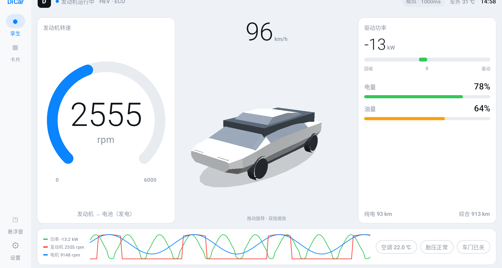
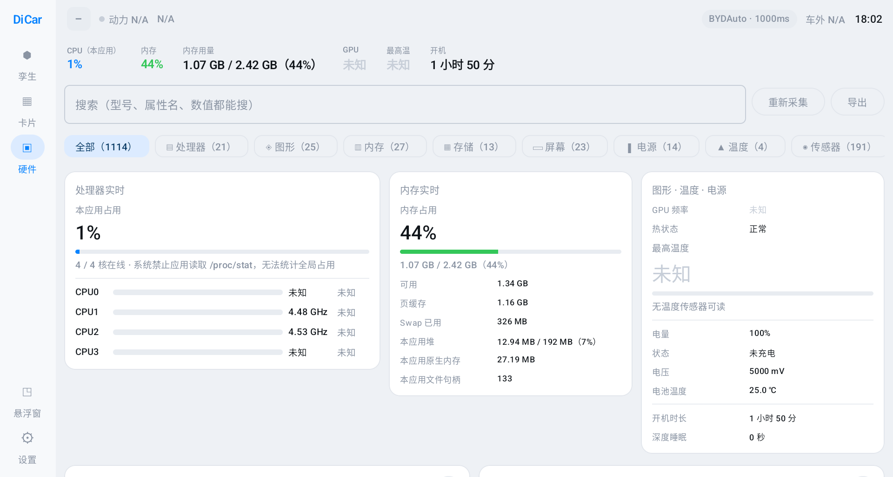

# DiCar 车况 · DiCar Vehicle HMI

[简体中文](#简体中文) · [English](#english)

<p align="center">
  
</p>

---

## 简体中文

运行在比亚迪 DiLink 车机上的本地车辆仪表与控制 App：读取整车数据、显示孪生仪表盘、
控制空调与车窗，并提供可配置的悬浮窗。

**车辆数据全部在本机处理，不上传任何内容。** 全 App 只有一处会访问外部网络——
「检查更新」会向 GitHub 发一次匿名请求比对版本号，默认仅在你手动点击时发生
（设置里可以打开「启动时自动检查」）。请求不携带任何车辆数据或设备标识。

「硬件信息」页读到的东西同样只留在本机。导出的文本**默认会把序列号、MAC、IP、
Android ID 这类能定位到这台车机的字段打码**，需要完整内容可以在导出弹窗里关掉开关。
这一页也刻意不申请定位权限，代价是 Wi-Fi 名称和 BSSID 读不到（安卓 8.1 起它们归定位管）。

> ⚠️ 个人项目，与比亚迪官方无关。接口全部来自公开逆向资料，不同车型/固件差异很大，
> 请自行评估风险。控制类功能（车窗、天窗、空调）会让车辆真实动作。

### 功能

| | |
|---|---|
| **孪生主页** | 横屏三栏：左转速大表盘、中大号车速 + 车辆俯视图（四门两盖、车窗与天窗开度、四轮胎压胎温、转向灯、泊车雷达实时联动）、右驱动/回收双向功率条与电量油量；底栏近 3 分钟趋势曲线（发动机介入时自动增加转速曲线）+ 空调/胎压/车门状态。竖屏自动改为上下堆叠 |
| **3D 车辆模型** | 可选（默认关）。孪生图换成可拖动旋转、双指缩放的 3D 车，四门开合、车窗升降、车轮转速、转向灯都跟实时数据联动。车模是代码里程序化生成的低多边形网格，不引任何 3D 引擎或外部模型文件 |
| **卡片视图** | 动力、电池、空调、车身、其他五类全量读数 |
| **控制** | 空调开关 / 温度 / 风量 / 出风模式 / 循环、座椅加热通风、四门车窗、天窗、遮阳帘、前挡除霜 |
| **悬浮窗** | 浮在其他应用之上，内容（主读数 / 仪表 / 曲线 / 孪生图 / 明细）可自由勾选，透明度可调，可拖动 |
| **前台服务** | 后台持续采集，通知栏常驻「车速 \| SOC \| 空调」 |
| **硬件信息** | 车机**自身**的完整硬件清单：SoC 与大小核分簇、每核实时频率与占用、GPU 能力与扩展、内存/存储/分区、屏幕与多屏、传感器、摄像头、网络、音频、编解码器与 DRM，以及全量系统属性（常有上千条）。支持搜索和分类过滤，可导出为文本 |
| **检查更新** | 对比 GitHub 上的最新发布版本，可跳转发布页或直接下载 APK。默认手动触发；「启动时自动检查」是可选开关 |
| **接口探测** | 一键导出车机上全部 `android.hardware.bydauto.*` 的类、常量、方法与当前读数，用于适配新车型 |

<p align="center">
  
  
  <br>
  
  
  <br>
  
</p>

### 它是怎么拿到数据的

车辆数据由车机的 `android.hardware.bydauto.*` 框架提供，但读写被 `BYDAUTO_*_GET/SET`
**签名级权限**保护，第三方 App 自己调用会被车机服务端拒绝（`permission deny`）。
本项目提供两条通道，自动择优：

1. **无线调试通道（主）** — App 内置 ADB 客户端连接车机本机 `127.0.0.1:5555`，
   以调试身份用 `app_process` 启动辅助进程，由它调用 `BYDAutoDeviceManager` 读写。
   首次连接时车机会弹出「允许调试」，授权一次即可。一轮轮询所有字段只用**一次**跨进程往返。
2. **进程内通道（备）** — 直接反射调用。部分权限较宽松的车型可用。

另有迪加（DiPlus）HTTP 接口作为备用数据源。

### 构建

需要 JDK 17 与 Android SDK（platform 35 / build-tools 35），在 `local.properties` 指定 SDK 路径。

```bash
./gradlew assembleRelease   # 产物在 app/build/outputs/apk/release/
./gradlew testDebugUnitTest
```

Release 版的签名密钥不在仓库里。自己编译时会自动退回 debug 签名，能正常安装使用；
要用自己的正式密钥，在项目根目录放一个 `keystore.properties`（已被 `.gitignore` 忽略）：

```properties
storeFile=/path/to/your-release.jks
storePassword=...
keyAlias=...
keyPassword=...
```

### 安装与首次使用

APK 可以直接从 [Releases](https://github.com/tsix2019/dicar2/releases) 下载，也可以自己编译。

```bash
adb connect <车机IP>:5555
adb install -r app-release.apk
```

> 如果你装过 0.1.0 之前自行编译的版本（调试签名），覆盖安装会报
> `INSTALL_FAILED_UPDATE_INCOMPATIBLE`——Android 不允许签名变更。
> 先 `adb uninstall com.dicar.vehicle` 再装即可，此后各版本都能直接覆盖升级。

1. 车机开启无线 ADB。
2. 打开 App，设置里选「自动」或「仅 BYDAuto」。
3. 车机弹出「允许调试」时勾选**一律允许**。
4. 若仍无数据：`adb logcat -s AdbTransport HelperSession BydAutoDataSource`。

### 适配到其它车型

`BydApiMap.kt` 集中了所有接口映射（方法名、FID 符号、数值编码），适配新车基本只改这一个文件。
每一项都带来源标记：

| 标记 | 含义 |
|---|---|
| `[D4]` | 在 DiLink 4.0（Android 10）探测报告中确认存在 |
| `[D3]` / `[D5]` | 公开资料中在 DiLink 3 / 5 实车验证 |
| `[?]` | 推测，需用「设置 → 探测 BYDAuto 接口」核对 |

### 许可

MIT。参考过的公开资料：[BYDMate](https://github.com/AndyShaman/BYDMate)、
[byd-apps](https://github.com/wheregoes/byd-apps)。

---

## English

A local vehicle dashboard and control app for BYD DiLink head units: reads live vehicle data,
renders a digital-twin dashboard, controls climate and windows, and offers a configurable
floating overlay.

**All vehicle data is processed on-device and never uploaded.** The app makes exactly one kind of
external network request: the update check asks GitHub for the latest release tag, and by default
that only happens when you tap "check for updates" (an opt-in "check on launch" toggle exists in
settings). The request carries no vehicle data and no device identifier.

Everything the hardware page reads also stays on the device. Exported reports **redact serial
numbers, MAC addresses, IPs, the Android ID and similar device-identifying fields by default** —
there is a switch in the export dialog if you need them. That page also deliberately avoids
requesting location permission, at the cost of not being able to show the Wi-Fi SSID or BSSID
(Android has gated those behind location since 8.1).

> ⚠️ Personal project, not affiliated with BYD. All interfaces come from public
> reverse-engineering work and vary a lot across models and firmware — use at your own risk.
> Control features (windows, sunroof, climate) physically actuate the car.

### Features

| | |
|---|---|
| **Twin dashboard** | Three columns in landscape: a large RPM dial on the left; big speed readout plus a top-down car view (doors, window/sunroof position, tyre pressure and temperature, turn signals, parking radar — all live) in the middle; a bidirectional drive/regen power bar with battery and fuel levels on the right. A bottom strip carries the 3-minute trend chart (an engine-RPM series appears automatically once the engine kicks in) and climate/tyre/door status pills. Stacks vertically in portrait |
| **3D car model** | Optional, off by default. Swaps the twin view for a drag-to-rotate, pinch-to-zoom 3D car whose doors, windows, wheel rotation and turn signals all track live data. The mesh is generated procedurally in code — no 3D engine dependency and no external model files |
| **Card view** | Full readouts grouped into powertrain, battery, climate, body and misc |
| **Controls** | A/C power, temperature, fan, vent mode, recirculation, seat heating/ventilation, all four windows, sunroof, sunshade, windshield defrost |
| **Floating overlay** | Floats above other apps; which blocks to show (readout / gauges / chart / twin view / details) and the opacity are configurable, and it is draggable |
| **Foreground service** | Keeps polling in the background with a persistent "speed \| SoC \| A/C" notification |
| **Hardware info** | A full inventory of the head unit **itself**: SoC and big.LITTLE clusters, live per-core frequency and load, GPU limits and extensions, RAM/storage/partitions, displays, sensors, cameras, radios, audio, codecs and DRM, plus every system property (often well over a thousand). Searchable, filterable by category, and exportable as text |
| **Update check** | Compares against the latest GitHub release; opens the release page or the APK directly. Manual by default; "check on launch" is opt-in |
| **Interface probe** | One tap dumps every `android.hardware.bydauto.*` class, constant, method and current value from the head unit — the basis for porting to other models |

### How it gets the data

Vehicle data lives behind the head unit's `android.hardware.bydauto.*` framework, but reads and
writes are guarded by **signature-level** `BYDAUTO_*_GET/SET` permissions, so a third-party app
calling them directly is rejected by the vehicle service (`permission deny`). The app provides two
channels and picks whichever works:

1. **Wireless-debugging channel (primary)** — a built-in ADB client connects to the head unit's own
   `127.0.0.1:5555`, launches a helper process via `app_process` under the shell identity, and that
   helper talks to `BYDAutoDeviceManager`. The head unit shows its "allow debugging" prompt once.
   A full polling round costs a **single** round trip thanks to request batching.
2. **In-process channel (fallback)** — plain reflection, which works on more permissive firmware.

A DiPlus local HTTP API is supported as an alternative data source.

### Build

Requires JDK 17 and the Android SDK (platform 35 / build-tools 35); point `local.properties` at your SDK.

```bash
./gradlew assembleRelease   # output in app/build/outputs/apk/release/
./gradlew testDebugUnitTest
```

### Install

Grab the APK from [Releases](https://github.com/tsix2019/dicar2/releases), or build it yourself.

```bash
adb connect <head-unit-ip>:5555
adb install -r app-release.apk
```

> If you previously side-loaded a self-built (debug-signed) build from before 0.1.0, installing over
> it fails with `INSTALL_FAILED_UPDATE_INCOMPATIBLE` — Android does not allow a signing-key change.
> Run `adb uninstall com.dicar.vehicle` once; every release from 0.1.0 on upgrades in place.

Enable wireless ADB on the head unit, open the app, pick "Auto" or "BYDAuto only" in settings, and
accept the "allow debugging" prompt on the head unit.

### Porting to other models

`BydApiMap.kt` holds every interface mapping (method names, FID symbols, value encodings) in one
place — porting to a different car is mostly editing that single file. Each entry carries a
provenance tag: `[D4]` confirmed present in a DiLink 4.0 probe report, `[D3]`/`[D5]` verified on a
real DiLink 3/5 car in public research, `[?]` guessed and needing verification via
**Settings → Probe BYDAuto interfaces**.

### License

MIT. Built on public research from [BYDMate](https://github.com/AndyShaman/BYDMate) and
[byd-apps](https://github.com/wheregoes/byd-apps).
